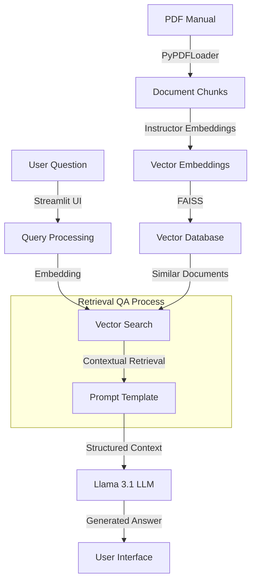

# Smart Home Manual Q&A System
## Technical Implementation Document

### 1. Problem Statement
The project addresses several key challenges in technical documentation accessibility:
- Users often struggle to quickly find specific information in lengthy smart home manuals
- Traditional keyword searches may miss contextually relevant information
- Technical support teams spend significant time answering repetitive questions
- Need for 24/7 accessible, accurate technical information

### 2. Solution Overview
A natural language Q&A system that leverages:
- Advanced Large Language Models for accurate response generation
- Vector database for efficient information retrieval
- Streamlit for an intuitive user interface
- PDF document processing capabilities

### 3. Tools & Technologies
#### 3.1 Core Components
- **LLM**: Groq's Llama-3.1-70b-versatile model
- **Vector Store**: FAISS (Facebook AI Similarity Search)
- **Embeddings**: HuggingFace Instructor Embeddings (hkunlp/instructor-large)
- **Framework**: LangChain for orchestration
- **Frontend**: Streamlit

#### 3.2 Key Libraries
- langchain_groq
- PyPDFLoader
- FAISS
- dotenv
- Streamlit

### 4. Dataset
- Source: Smart Home product manual (PDF format)
- Processing: 
  - PDF text extraction
  - Document chunking
  - Vector embeddings generation
  - FAISS index creation

### 5. High-Level Solution Architecture

### 6. Key Features
#### 6.1 Information Retrieval
- Context-aware document retrieval using FAISS
- Similarity score threshold (0.7) for quality control
- Efficient vector search capabilities

#### 6.2 Response Generation
- Zero-shot question answering
- Custom prompt template for accurate responses
- Source document reference maintenance

#### 6.3 User Interface
- Clean, minimalist design
- Real-time response generation
- Knowledge base creation functionality

### 7. Technical Innovations
1. **Hybrid Architecture**
   - Combines dense retrieval with neural language models
   - Enables both semantic search and natural language understanding

2. **Quality Control Mechanisms**
   - Score threshold filtering
   - Source document tracking
   - Custom prompt engineering

3. **Scalability Considerations**
   - Local vector database storage
   - Efficient document processing
   - Modular component design

### 8. Future Enhancements
1. **Performance Optimizations**
   - Caching frequently asked questions
   - Batch processing for multiple documents
   - Response time optimization

2. **Feature Additions**
   - Multi-document support
   - User feedback integration
   - Answer confidence scoring

3. **UI Improvements**
   - Advanced search filters
   - Response history tracking
   - Document section visualization

### 9. Implementation Benefits
1. **Business Impact**
   - Reduced support ticket volume
   - Improved customer satisfaction
   - Faster information access
   - Consistent response quality

2. **Technical Excellence**
   - Modern tech stack utilization
   - Scalable architecture
   - Maintainable codebase

3. **Innovation Factors**
   - State-of-the-art LLM integration
   - Vector search capabilities
   - Custom prompt engineering

### 10. Screenshots
[Note: Add screenshots of your application showing:]
1. Main Q&A interface
2. Knowledge base creation process
3. Sample question-answer interaction
4. Error handling displays
5. Loading states and processing indicators

